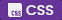

<h1> Jose Silva (bakonpancakz)</h1>
<h3>Freelancer ~ Full-Stack Developer</h3>
<i>❝ building dreams one line at a time ❞</i>

<h3>My Toolkit</h3>

Listed in no particular order, just things I use regularly:

    
    
    
    
    
    
    
    
    
    
    
    
    
    
    
    
    
    
    

<h3>My Stuff</h3>

Personal projects cleaned up and documented for public use:

<table>
    <thead>
        <tr align="left">
            <th width="200px">Name</th>
            <th width="700px">Description</th>
            <th width="200px">Links</th>
        </tr>
    </thead>
    <tbody>
        <tr>
            <td>📧 tools-email</td>
            <td>Provide your application a way to send emails with minimal setup</td>
            <td><a href="https://github.com/bakonpancakz/tools-email">Repository</a></td>
        </tr>
        <tr>
            <td>📦 tools-gatekeeper</td>
            <td>Use HMAC Tokens and Patterns to Gatekeep S3 Objects</td>
            <td><a href="https://github.com/bakonpancakz/tools-gatekeeper">Repository</a></td>
        </tr>
        <tr>
            <td>⌚ discord-trackpad</td>
            <td>Show off your Wakatime and Lines of Code on Discord</td>
            <td><a href="https://github.com/bakonpancakz/discord-trackpad">Repository</a></td>
        </tr>
        <tr>
            <td>
                    
                Cart Ride Around a Fumo
            </td>
            <td>A cute game I made on ROBLOX for fun, try it!!!</td>
            <td><a href="https://www.roblox.com/games/9987852646">Game</a></td>
        </tr>
        <!-- <tr>
            <td>tools-stickerboard</td>
            <td>Allow strangers to *safely* place GIFs and Images onto your Steam Profile</td>
            <td>
                <a href="https://github.com/bakonpancakz/tools-stickerboard">Repository</a>
                &bull;
                <a href="https://stickers.panca.kz">Website</a>
            </td>
        </tr>
        <tr>
            <td>discord-clips</td>
            <td>Media Sharing Website for Discord Users</td>
            <td>
                <a href="https://github.com/bakonpancakz/discord-clips">Repository</a>
                <a href="https://clips.panca.kz">Website</a>
            </td>
        </tr> -->
    </tbody>
</table>

 

Wanna get in touch? Find me here!

    
    
    
    

<h6 align="center">
    <i>Twitter is a personal space - beware!</i>
</h6>
