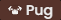

<h1> bakonpancakz</h1>

<b>Current Mission:</b> be awesome sauce

Things which I use on a regular basis, displayed in no particular order:

    
    
    
    
    
    
    
    
    
    
    
    
    
    
    
    
    
    
    
    
    
    
    
    
    
    

Personal projects that I consider cool enough to show off:

<table>
    <thead>
        <tr align="left">
            <th width="200px">Name</th>
            <th width="700px">Description</th>
            <th width="200px">Links</th>
        </tr>
    </thead>
    <tbody>
        <!-- Public -->
        <tr>
            <td>💬 dsoob</td>
            <td>Self-Hosted Communication Platform</td>
            <td><a href="https://github.com/bakonpancakz/dsoob">Repository</a></td>
        </tr>
        <tr>
            <td>🎨 gifuu</td>
            <td>The anonymous gif sharing site</td>
            <td><a href="https://github.com/bakonpancakz/gifuu">Repository</a></td>
        </tr>
        <tr>
            <td>💫 oneshot</td>
            <td>Cross-Platform Game Engine (Used by KUMA)</td>
            <td><a href="https://github.com/bakonpancakz/oneshot">Repository</a></td>
        </tr>
        <tr>
            <td>🧪 clitools</td>
            <td>Curious collection of CLI Tools & Scripts</td>
            <td><a href="https://github.com/bakonpancakz/clitools">Repository</a></td>
        </tr>
        <!-- Personal -->
        <tr>
            <td>
                    
                Cart Ride Around a Fumo
            </td>
            <td>A cute game I made on ROBLOX for fun, try it!!!</td>
            <td><a href="https://www.roblox.com/games/9987852646">Game</a></td>
        </tr>
        <tr>
            <td>🥕 bunniezluvkarrotz</td>
            <td>Deceptively high quality abandonware (from me)</td>
            <td><a href="https://github.com/bunniezluvkarrotz">Website</a></td>
        </tr>
    </tbody>
</table>

 

Find me here!

    
    
    <!--  -->
    <!--  -->

<h6 align="center">
    <i>Twitter is a personal space — beware!</i>
</h6>
